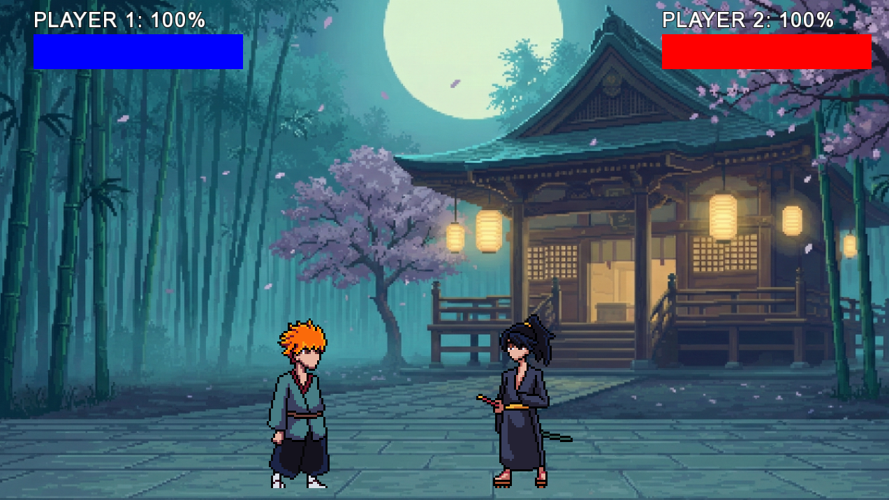

# ⚔️ Broken Stance

> A raw, arcade-style 1v1 fighting game engine built from scratch in C++.



## 📖 About The Project
I built **Broken Stance** to dive deep into the fundamentals of game engine architecture. Instead of using a pre-made engine like Unity or Unreal, I wanted to understand **how** games work under the hood. 

This project explores **State Machines**, **Memory Management**, **AABB Collision Detection**, and **Frame-Perfect Animation Handling** using C++ and SFML. It’s a love letter to classic arcade fighters, featuring smooth combat, audio feedback, and a complete game loop.

## 🎮 Features
* **Custom Physics Engine**: Hand-written gravity, velocity, and friction logic.
* **State Machine Architecture**: A robust system managing Menu, Instructions, Gameplay, and Game Over states.
* **Local PvP**: 1v1 combat on a shared keyboard (Arcade style).
* **Audio System**: Integrated sound effects for attacks, hits, and menu navigation using `SFML/Audio`.
* **Responsive UI**: A fully navigable menu system with input locking to prevent scrolling bugs.
* **Hitboxes & Hurtboxes**: Precise collision detection for combat interaction.

## 🕹️ Controls

| Action | Player 1 (Boy) | Player 2 (Girl) |
| :--- | :---: | :---: |
| **Move** | `W` `A` `S` `D` | `Arrow Keys` |
| **Attack** | `Q` | `K` |
| **Jump** | `W` | `Up Arrow` |

* **Menu Navigation**: `Up` / `Down` arrows + `Enter`
* **Restart Match**: `R` (On Game Over screen)
* **Quit to Menu**: `ESC`

## 🛠️ Built With
* **Language**: C++
* **Library**: [SFML](https://www.sfml-dev.org/) (Simple and Fast Multimedia Library)
* **Audio & Graphics**: Custom asset integration

## 🚀 Getting Started

### Prerequisites
* A C++ compiler (GCC/MinGW recommended).
* SFML 2.5.1+ installed.

### Build & Run (Windows MinGW)
```bash
g++ game.cpp -o game.exe -I"C:/SFML/include" -L"C:/SFML/lib" -lsfml-graphics -lsfml-window -lsfml-system -lsfml-audio
